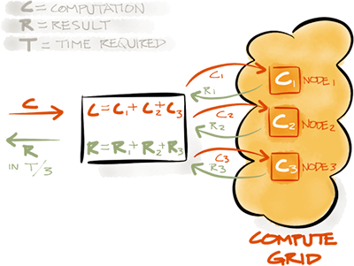

# Compute Grid



**Computations** are used to execute arbitrary code in server nodes.

Ignite ensures code is **serialized**, **sent over the network**, **deserialized** and **executed** in server nodes.


## Example

```java
import org.apache.ignite.*;

public class Main {

    public static void main(String[] args) {

        Ignite ignite = Ignition.start();

        ignite.compute().run(() -> System.out.println("Hello World"));
    }
}
```
This code prints `Hello World` in one **server node**. 


## Runnable

An **IgniteRunnable** does not return any result. It just sends computations to the cluster.

Complete TODOs in **Step1_Runnable** and make all tests in **Step1_RunnableTest** pass.


## Callable

An **IgniteCallable** does return a result. It sends computation in the cluster and get result back to calling node.

Complete TODOs in **Step1_Callable** and make all tests in **Step1_CallableTest** pass.


## Spot the difference

Can you spot the difference between case 1 and 2 ?

```java
import org.apache.ignite.*;

public class App {

    public static void main(String[] args) {

        Ignite ignite = Ignition.start();

        // Case 1
        String nodeId1 = ignite.compute().call(() -> System.getProperty("node.id"));

        // Case 2
        String nodeId2 = System.getProperty("node.id");
        String nodeId3 = ignite.compute().call(() -> nodeId);
    }
}
```

Try it !


## Solution

- Case 1: value is computed **inside** the lambda, on the executing **server node**.

- Case 2: value is computed **outside** the lambda, its value is fixed on **client node**, serialized and sent to **server node**.


[Home](../readme.md) | [Back](./get-started.md) | [Next](./part2_data-grid.md)
