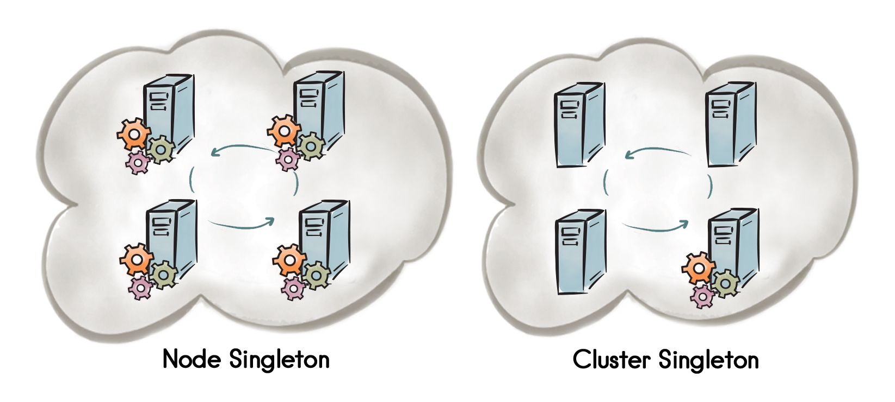

# Service Grid

This part is about deploying **services** in the cluster.



=========
## Services

**Services** can be used in **computations** to avoid heavy lambda serializations.

Ignite allows deploying multiple instances of a given **Service** across the cluster.

Ignite ensures **proper deployment** and **fault tolerance** of the defined services. 

=========
## Service Grid: How To

```java
import org.apache.ignite.*;
import org.apache.ignite.services.*;

public class App {
    public static void main(String[] args) {

        Ignite ignite = Ignition.start();

        ServiceConfiguration configuration = new ServiceConfiguration();
        configuration.setService(new MyService());
        configuration.setName("my-service");
        configuration.setTotalCount(6);
        configuration.setMaxPerNodeCount(3);

        ignite.services().deploy(configuration);

        String value = ignite.services().service("my-service").myServiceComputation();
    }
}
```

Here Ignite deploys **6 service instances** across the cluster but with **3 instances max per node**. 

`myServiceComputation` method is then called on a **locally deployed service instance**.

=========
## Computer Service

Complete **ComputerService** class.

This class is the service to be deployed in the following steps.

=========
## Cluster Service

A cluster service has **only one instance** deployed in **all nodes** in the cluster.

=========
## Cluster Service: Code It

Complete **Step1_ClusterService** class.

Run it:
```bash
./gradlew runClient
Part4_Step1
```

=========
## Cluster Service: Check

Ensure **sum is properly computed** in all cases.

Check **server nodes** consoles and find node where **cluster service** is deployed.

**Kill this server node**... wait.

**Execute step again**, service should be automatically deployed in another node.

Restart killed **server node**.

=========
## Node Service

A node service has **one instance** deployed in **each node** in the cluster.

=========
## Node Service: Code It

Complete **Step2_NodeService** class.

Run it:
```bash
./gradlew runClient
Part4_Step2
```

=========
## Node Service: Check

Ensure **sum is properly computed** in all cases.

Check **server nodes** consoles and ensure service is deployed in **each node**.

=========
## Custom Service

Service instances can totally be customized across the cluster.

Ignite let's you specify the **total count** of instances in the cluster and the **maximum count** in each node.

=========
## Custom Service: Code It

Complete **Step3_CustomService** class.

Run it:
```bash
./gradlew runClient
Part4_Step3
```

=========
## Custom Service: Check

Ensure there are **5 services instances** in the cluster.

**Execute step multiple times**, ensure services calls are load-balanced on different nodes.

**Kill one server node**... wait.

**Execute step again**, ensure service is still available and limit of 2 instances per node is respected (4 services in total).

Restart killed **server node**.

=========
## Affinity Service

Services can be deployed following **cache key affinity**.

This allows **collocating services with data**. Powerful.

=========
## Affinity Service: Code It

Complete **Step4_AffinityService** class.

Run it:
```bash
./gradlew runClient
Part4_Step4
```

=========
## Affinity Service: Check

Ensure **nodeId** retrieved with `affinityCall` corresponds to the node where **service is deployed**.

**Kill this server node**... wait.

**Execute step again**, ensure service is available in another node and **nodeId** matches **node** where service is now deployed.

Restart killed **server node**.

=========
## Train is coming

```sh
           ____/____________________   ______________________   ______________________ 
          /_]  [___][___][___][___] | | [___][___][___][___] | | [___][___][___][___] |
         /__________________________| |______________________| |______________________|
         `-o-o-o--------------o-o-o-'-'-o=o--------------o=o-'-'-o=o--------------o=o-'
```

That's it. You now have all elements to begin coding the **demo application**.

If you have enough time you can follow with **messaging & events** and **cluster** parts, otherwise, no problem, go for the **demo**.

[Home](../readme.md) | [Back](./part2_data-grid.md) | [Next](part4_messaging.md)
